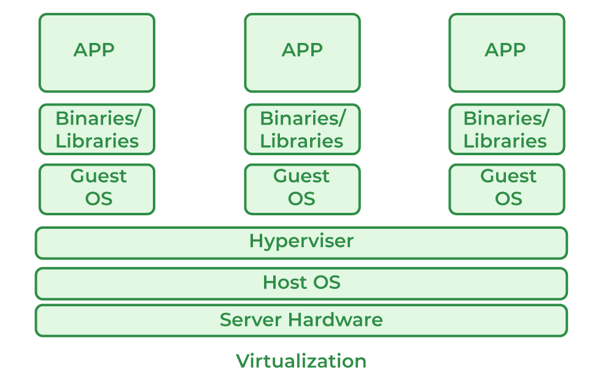

# Deployment

## Virtualization
Pernahkah kalian melihat sebuah rumah besar yang mewah dengan banyak sekali kamar, nahh sama halnya dengan hal tersebut tanpa virtualisasi, setiap orang membutuhkan rumah sendiri untuk tinggal, sehingga banyak hal hal (tanah, material bangunan, dll.) yang tidak digunakan. Dengan virtualisasi, satu rumah besar dapat dibagi menjadi beberapa kamar, masing-masing dengan pintu dan fasilitas masing masing, sehingga beberapa penghuni dapat tinggal dalam satu rumah besar dengan efisien. Dalam konteks ini, Rumah besar dapat sebagai Hardware atau servernya, Kamar sebagai VM, penghuni = OS atau software yang berada dalam VM, dan Hypervisor dapat sebagai house keeper yang mengatur pembagian dan penggunaan kamar. 

Jadi dapat disimpulkan, virtualisasi adalah teknologi yang memungkinkan pembuatan mesin virtual di dalam satu fisik server. Dengan menggunakan hypervisor, virtualisasi memungkinkan pengelolaan beberapa sistem operasi atau aplikasi yang berjalan secara mandiri. Konsep dasar virtualisasi melibatkan isolasi sumber daya antara mesin virtual, sehingga setiap mesin virtual dapat beroperasi seolah-olah menjadi mesin fisik yang terpisah.

#### Sub-subtitle

[Cheatsheet Markdown bisa dilihat disini](https://github.com/adam-p/markdown-here/wiki/Markdown-Cheatsheet)

## To-do (delete later)
- Virtualization
- Nginx
- Firewall
- Security (fail2ban, ufw, hardening ssh, intinya pengamanan dasar vm)
- Deployment DVWA (Live Demo, kalian bisa demoin mau hypervisor atau container)