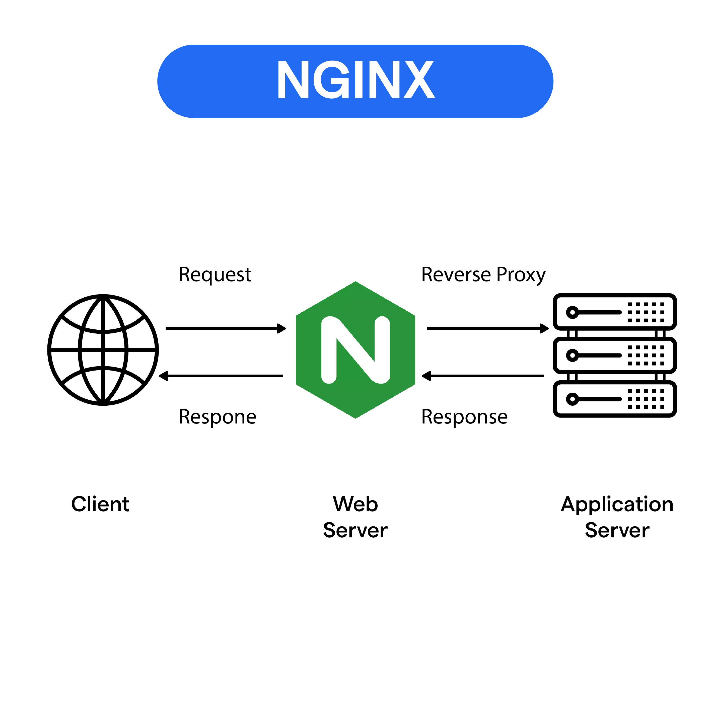
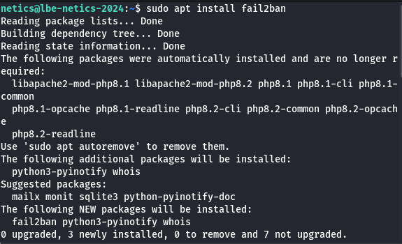
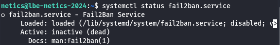
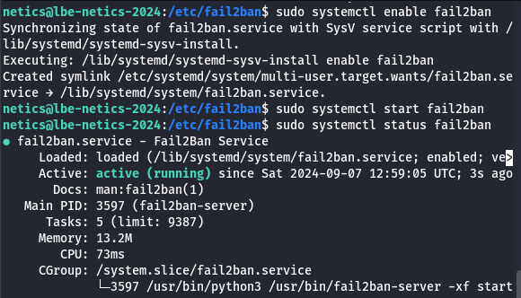
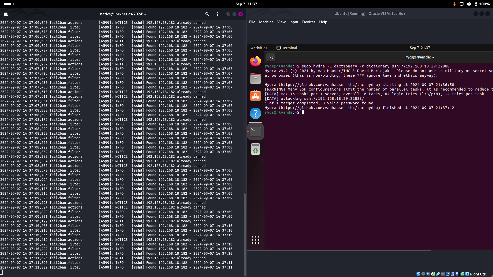

# Deployment

## Virtualization

Pernahkah kalian melihat sebuah rumah besar yang mewah dengan banyak sekali kamar, nahh sama halnya dengan hal tersebut tanpa virtualisasi, setiap orang membutuhkan rumah sendiri untuk tinggal, sehingga banyak hal hal (tanah, material bangunan, dll.) yang tidak digunakan. Dengan virtualisasi, satu rumah besar dapat dibagi menjadi beberapa kamar, masing-masing dengan pintu dan fasilitas masing masing, sehingga beberapa penghuni dapat tinggal dalam satu rumah besar dengan efisien. Dalam konteks ini, Rumah besar dapat sebagai Hardware atau servernya, Kamar sebagai VM, penghuni sebagai OS atau software yang berada dalam VM, dan Hypervisor dapat sebagai house keeper yang mengatur pembagian dan penggunaan kamar.

Jadi dapat disimpulkan, virtualisasi adalah teknologi yang memungkinkan pembuatan mesin virtual di dalam satu fisik server. Dengan menggunakan hypervisor, virtualisasi memungkinkan pengelolaan beberapa sistem operasi atau aplikasi yang berjalan secara mandiri. Konsep dasar virtualisasi melibatkan isolasi sumber daya antara mesin virtual, sehingga setiap mesin virtual dapat beroperasi seolah-olah menjadi mesin fisik yang terpisah.


## Contenarization

Berbeda dengan virtualisasi, kontainerisasi dianalogikan sebagai sebuah kapal kargo besar yang mengangkut berbagai macam barang di dalam sebuah kontainer. Setiap kontainer dapat berisi barang yang berbeda dan memiliki tujuan yang berbeda pula, namun semuanya diangkut menggunakan satu kapal yang sama. Dalam konteks ini, kapal kargo dapat sebagai Kernel sistem operasi yang sama, peti kemas sebagai Kontainer, barang di dalam peti kemas sebagai Aplikasi dan dependensinya, dan pelabuhan sebagai Platform seperti Docker atau Kubernetes yang mengelola kontainer

Jadi dapat disimpulkan, Containerization adalah teknologi yang memungkinkan pengemasan aplikasi dan dependensinya ke dalam sebuah wadah (container) yang dapat dijalankan secara konsisten di berbagai lingkungan komputasi, tanpa perlu mengubah kode atau konfigurasi aplikasi itu sendiri. Container merupakan unit yang portabel, ringan, dan dapat diisolasi, yang mengemas aplikasi, library, dan konfigurasi menjadi satu entitas yang dapat dijalankan di lingkungan yang berbeda, seperti lokal, cloud, atau pusat data.


## Virtualization VS Contenarization

- Virtualisasi menggunakan hypervisor untuk menciptakan mesin virtual yang masing-masing memerlukan sistem operasi lengkap dan isolasi sumber daya seperti CPU, RAM, dan penyimpanan. Sebaliknya, kontainerisasi menggunakan teknologi seperti Docker untuk membuat kontainer yang berbagi sistem operasi host.

- Virtualisasi memungkinkan menjalankan berbagai sistem operasi dan aplikasi secara bersamaan dalam mesin virtual yang terisolasi. Sementara itu, kontainerisasi memungkinkan menjalankan aplikasi yang dibungkus dalam kontainer pada host yang sama, dengan berbagi kernel sistem operasi yang sama.

- Virtualisasi lebih cocok untuk aplikasi yang membutuhkan isolasi penuh, konfigurasi kompleks, dan dukungan untuk berbagai sistem operasi. Di sisi lain, kontainerisasi lebih ideal untuk aplikasi yang ringan, portabel, dan dapat dijalankan di berbagai lingkungan komputasi.

- Proses startup pada virtualisasi memerlukan waktu lebih lama karena melibatkan booting sistem operasi dan konfigurasi tambahan pada setiap mesin virtual. Sementara itu, kontainerisasi memungkinkan proses deploy dan startup yang lebih cepat karena hanya perlu menjalankan kontainer yang sudah dikemas dan siap dijalankan.


## Nginx

Berdasarkan dengan penjelasan pada web documention dari [NGINX](https://nginx.org/en/), Nginx merupakan sebuah server HTTP dan reverse proxy, server proxy untuk email, serta server proxy generik untuk TCP/UDP, yang awalnya ditulis oleh Igor Sysoev. Nginx juga merupakan salah satu web server yang bersifat open source yang dapat juga digunakan untuk load balancing dan caching. NGINX sangat populer karena kecepatan dan kemampuannya menangani banyak permintaan secara efisien. Berbeda dengan server web biasanya, NGINX dirancang untuk dapat menangani ribuan permintaan dalam waktu yang bersamaan tanpa menguras resources dari server itu sendiri. Berikut adalah default nginx configuration:

#### Default NGINX Configuration

```conf
server {
        listen 80 default_server;
        listen [::]:80 default_server;
        root /var/www/html;

        index index.html index.htm index.nginx-debian.html;

        server_name _;

        location / {
                try_files $uri $uri/ =404;
        }
}
```

- `Listen 80`, menyatakan bahwa nginx server nantinya akan menangkap request melalui port 80 yang merupakan post standar dari http
- `listen [::]:80` default_server, sama seperti sebelumnya, yang berbeda adalah bagian ini menerima dari ipv6 yang dimana notasinya sama seperti 0.0.0.0
- `root /var/www/html`, menyatakan direktori root tempat file website disimpan. Dalam kasus ini, semua file HTML, CSS, JavaScript, dan resources lainnya diambil dari folder /var/www/html.
- `index index.html index.htm index.nginx-debian.html`, menentukan Urutan prioritas file pada direktory root, prioritasnya adalah index.html, jika tidak ditemukan maka NGINX mencari index.htm, dan jika itu juga tidak ada, NGINX akan mencoba index.nginx-debian.html
- `server_name _`, Ini berarti server ini menerima permintaan untuk semua nama domain atau subdomain. Hal ini ditunjukkan dengan penggunaan wild card `_`.
- `try_files $uri $uri/ =404;`, pada bagian ini terdapat sebuah direktif yang berguna memberi tahu NGINX untuk mencoba beberapa file atau direktori yang diminta oleh user, jika gagal akan mengeluarkan respons 404.

### Apa saja hal lain yang dapat dilakukan oleh NGINX?

- Reverse Proxy: NGINX bertindak sebagai jembatan penghubung antara user dan server backend (server tempat aplikasi atau website sebenarnya berjalan). Misalnya, jika ada banyak permintaan dari user, NGINX akan melakukan forwarding / meneruskan permintaan tersebut ke server lain, sehingga server utama tidak kelebihan beban.



##### Simple Reverse Proxy Configuration

```conf
server {
    listen 80;
    server_name example.com;

    location / {
        proxy_pass http://backend_server;
        proxy_set_header Host $host;
        proxy_set_header X-Real-IP $remote_addr;
        proxy_set_header X-Forwarded-For $proxy_add_x_forwarded_for;
        proxy_set_header X-Forwarded-Proto $scheme;
    }
}
```

- Load Balancer: Jika sebuah aplikasi atau website di-hosting pada beberapa server, NGINX bisa mendistribusikan permintaan dari user ke server-server tersebut secara merata. Ini memastikan bahwa semua server bekerja sama untuk menangani lalu lintas, sehingga website tetap cepat dan tidak down.

##### Simple Load Balancer Configuration

```conf
http {
    upstream backend_servers {
        server backend1.example.com;
        server backend2.example.com;
        server backend3.example.com;
    }

    server {
        listen 80;
        server_name example.com;

        location / {
            proxy_pass http://backend_servers;
        }
    }
}

```

- Caching: NGINX juga bisa menyimpan halaman website sementara (cache), sehingga ketika user yang sama mengunjungi kembali website, halaman dapat dimuat lebih cepat tanpa perlu mengambilnya lagi dari server backend.

##### Simple Caching Configuration

```conf
proxy_cache_path /var/cache/nginx levels=1:2 keys_zone=my_cache:10m max_size=10g inactive=60m use_temp_path=off;

server {
    listen 80;
    server_name example.com;

    location / {
        proxy_cache my_cache;
        proxy_pass http://backend_server;
        proxy_cache_valid 200 302 10m;
        proxy_cache_valid 404 1m;
        add_header X-Cache-Status $upstream_cache_status;
    }
}

```

## Firewall

### Pengertian Firewall

Pernahkah kalian melihat sebuah film bertema casino? Pada casino di film tersebut biasa terdapat sebuah tempat penjaga yang berfungsi untuk menjaga sekaligus melakukan pengecekan terhadap semua orang yang masuk dan keluar, apakah orang tersebut diperbolehkan masuk atau tidak? apakah orang yang keluar telah mencuri suatu barang atau tidak? Nahh tempat penjaga casino ini sama dengan sebuah firewall, jadi dapat disimpulkan bahwa Firewall adalah sebuah Network Security System yang digunakan untuk memantau dan mengendalikan traffic jaringan masuk dan keluar berdasarkan aturan keamanan yang telah ditetapkan. Firewall dapat berupa perangkat keras (hardware) atau perangkat lunak (software), dan fungsinya adalah untuk melindungi jaringan komputer dari ancaman eksternal seperti peretasan, virus, dan serangan cyber lainnya.


### Fungsi Firewall

Firewall berfungsi sebagai "gerbang" atau "penjaga" antara jaringan internal (seperti LAN) dengan jaringan eksternal (seperti internet). Berikut beberapa fungsi utamanya:

- Mencegah unauthorized acces pada system: Mengizinkan hanya traffic yang sah dan memblokir yang tidak sah.
- Memfilter network traffic: Memastikan bahwa data yang masuk dan keluar sesuai dengan kebijakan keamanan yang telah ditetapkan.
- Mencegah serangan dari luar: Menjaga dari ancaman seperti serangan DDoS, virus, dan peretasan.
  Mengontrol akses ke jaringan: Membatasi akses pengguna dan perangkat tertentu ke jaringan.

### Jenis Jenis Firewall

- `Firewall Perangkat Lunak` (Software Firewall)
  Firewall yang berjalan di perangkat komputer atau server. Contoh: firewall bawaan pada Windows, seperti Windows Defender Firewall.

- `Firewall Perangkat Keras` (Hardware Firewall)
  Biasanya berupa router atau perangkat khusus yang ditempatkan di antara jaringan internal dan eksternal. Firewall ini umumnya digunakan dalam organisasi besar.

- `Packet-Filtering Firewall`
  Memeriksa setiap paket data yang melewati firewall berdasarkan header paket, seperti alamat IP dan nomor port. Jika sesuai dengan aturan, paket tersebut diizinkan masuk atau keluar.

- `Stateful Inspection Firewall`
  Firewall ini lebih canggih karena selain memeriksa paket data, juga memantau status koneksi untuk memastikan bahwa sesi komunikasi sah dan sesuai dengan aturan.

- `Proxy Firewall`
  Firewall ini bekerja dengan mengarahkan lalu lintas jaringan melalui server perantara (proxy), yang kemudian membuat permintaan atas nama pengguna.

- `Next-Generation Firewall (NGFW)`
  Firewall generasi terbaru yang menggabungkan beberapa fitur canggih seperti inspeksi deep packet, pemantauan aplikasi, dan deteksi intrusi untuk perlindungan lebih baik.

### Manfaat Firewall

- `Keamanan yang Ditingkatkan`: Melindungi jaringan dari ancaman eksternal dan mencegah akses tidak sah.

- `Kontrol Akses`: Memungkinkan administrator untuk menentukan siapa yang dapat mengakses bagian tertentu dari jaringan.

- `Monitoring Jaringan`: Firewall dapat digunakan untuk memantau lalu lintas jaringan dan mendeteksi aktivitas mencurigakan.

- `Proteksi Terhadap Virus dan Malware`: Mencegah penyebaran malware dan virus melalui jaringan dengan memblokir lalu lintas yang mencurigakan.

### Contoh Implementasi Firewall pada Linux instances

##### Mencoba untuk melakukan allowing port http, ssh, dan melakukan blocking pada port 13337

```sh
sudo ufw enable
```


```sh
sudo ufw allow ssh
sudo ufw allow http
```


```sh
sudo ufw deny 13337
```


```sh
sudo ufw status
```


## Security

### Apa itu keamanan?

Keamanan (security) dalam dunia digital merujuk pada praktik dan teknologi yang dirancang untuk melindungi sistem komputer, jaringan, data, dan aplikasi dari ancaman atau akses yang tidak sah. Keamanan sangat penting dalam memastikan bahwa informasi sensitif tidak jatuh ke tangan yang salah, bahwa sistem berjalan dengan aman dan efisien, dan untuk mencegah kerusakan yang bisa ditimbulkan oleh serangan siber.

### Tiga Pilar Keamanan: CIA TRIAD


Ada tiga pilar/prinsip utama dalam keamanan yang dikenal sebagai CIA TRIAD:

1. Confidentiality (kerahasiaan)
   Informasi hanya dapat diakses oleh pihak yang berwenang.

   Contoh: Bayangkan kamu punya diary (buku harian) yang hanya bisa dibaca oleh kamu. Untuk menjaga kerahasiaan diary tersebut, kamu mungkin akan menyimpannya di suatu tempat yang terkunci dan menggunakan kunci gembok untuk membukanya. Ini memastikan bahwa hanya kamu yang memiliki akses ke diary tersebut.

2. Integrity (integritas)
   Informasi tidak boleh berubah-ubah tanpa izin.

   Contoh: Bayangkan kamu menulis resep kue yang sangat lezat di sebuah kertas. Ketika kamu berbagi resep itu dengan orang lain, kamu ingin memastikan bahwa resep tersebut tetap sama, tanpa ada yang mengubah bahan atau langkahnya. Jika ada yang mengubah resep, kue yang dihasilkan akan berbeda.

3. Availability (ketersediaan)
   Informasi harus selalu tersedia ketika dibutuhkan.

   Contoh: Kamu punya keran air di rumah yang bisa digunakan kapan saja untuk minum, mandi, memasak, atau keperluan yang lain. Kamu menginginkan air tersebut selalu tersedia. Namun, jika tiba-tiba air tidak mengalir (karena pipa bocor atau masalah di pompa air), kamu tidak bisa menggunakan air saat membutuhkannya, sehingga aktivitas kamu terganggu.

### Apa saja yang dapat dilakukan untuk melindungi sistem?

#### SSH Hardening

##### Apa itu SSH Hardening?

SSH Hardening adalah proses memperkuat keamanan Secure Shell (SSH), yang merupakan protokol jaringan yang digunakan untuk mengakses dan mengelola server dari jarak jauh. Karena SSH sering menjadi target serangan brute-force dan serangan lainnya, sangat penting untuk mengamankan akses SSH. Berikut adalah beberapa teknik dan langkah yang bisa dilakukan untuk melakukan SSH hardening:

1. Gunakan SSH versi terbaru

2. Ubah port ssh
   Ubah portnya ke 22888 atau yang lain

   

3. Sesuaikan konfigurasi yang lain

   Contoh `PermitRootLogin no`, `PermitEmptyPasswords no`, `LoginGraceTime 20`, `PermitRootLogin no`, dan `MaxAuthTries 3`.

   PermitRootLogin no: Tidak mengizinkan ssh dengan user root.

   PermitEmptyPasswords no: Tidak mengizinkan login dengan password kosong.

   LoginGraceTime 20: Membatasi waktu login sebelum password salah.

   MaxAuthTries 3: Membatasi jumlah login sebelum password salah.

#### Menggunakan fail2ban

update dan install fail2ban

```sh
sudo apt update
sudo apt install fail2ban
```



cek status fail2ban

```sh
systemctl status fail2ban.service
```



Konfigurasi file sshd

```sh
sudo nano /etc/fail2ban/jail.d/sshd.conf
```

Tambahkan konfigurasi berikut untuk melindungi SSH:

```
[sshd]
enabled = true
port = ssh
filter = sshd
logpath = /var/log/auth.log
maxretry = 3
bantime = 1h
findtime = 5m
```

Penjelasan

enabled = true: Mengaktifkan monitoring sshd oleh Fail2Ban.

port = ssh: Menggunakan port yang digunakan oleh SSH.

filter = sshd: Menggunakan filter sshd bawaan Fail2Ban untuk memantau log ssh.

logpath = /var/log/auth.log: Menentukan lokasi log authentication.

maxretry = 3: Jika pengguna salah login 3 kali, maka akan diblokir.

bantime = 1h: Alamat IP yang gagal login akan diblokir selama 1 jam (1 hour).

findtime = 5m: Fail2Ban akan memeriksa log setiap 5 menit.

Konfigurasi file vsftpd

```sh
sudo nano /etc/fail2ban/jail.d/vsftpd
```

Tambahkan konfigurasi berikut untuk melindungi ftp:

```
[vsftpd]
enabled  = true
port     = ftp,ftp-data,ftps
filter   = vsftpd
logpath  = /var/log/vsftpd.log
maxretry = 3
bantime = 1h
findtime = 5m
```

Penjelasan

enabled = true: Mengaktifkan monitoring vsftpd oleh Fail2Ban.

port = ftp,ftp-data,ftps: Menyebutkan port yang digunakan oleh FTP (port default adalah 21).

filter = vsftpd: Menggunakan filter vsftpd bawaan Fail2Ban untuk memantau log FTP.

logpath = /var/log/vsftpd.log: Menentukan lokasi log vsftpd. Pastikan lokasi ini sesuai dengan file log yang digunakan oleh vsftpd.

maxretry = 3: Jika pengguna salah login 3 kali, mereka akan diblokir.

bantime = 1h: Alamat IP yang gagal login akan diblokir selama 1 jam (1 hour).

findtime = 5m: Fail2Ban akan memeriksa log setiap 5 menit.

```sh
sudo systemctl enable fail2ban
sudo systemctl restart fail2ban
sudo systemctl status fail2ban
```



Perintah di atas membuat fail2ban otomatis aktif (run) setiap kali sistem dinyalakan, restart fail2ban, dan cek status fail2ban apakah active atau tidak.

Ketika attacker mencoba melakukan bruteforce ip attacker akan terbanned.


