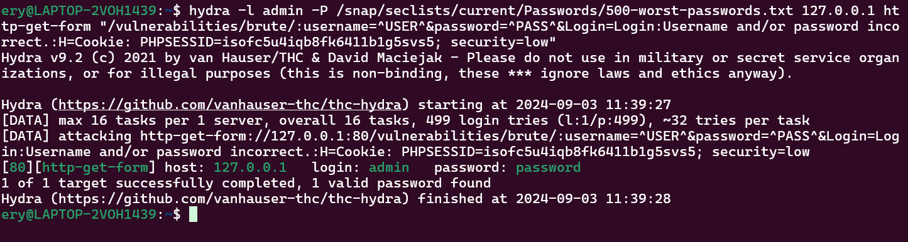

# Brute Force
## Definisi

Bruteforce attack merupakan salah satu serangan siber yang dimana seorang penyerang mencoba menebak suatu informasi seperti kata sandi, kunci enkripsi, dll.

Serangan ini dinamakan "brute force" karena mengandalkan kekuatan komputasi dan mencoba berbagai kombinasi secara sistematis.

## Jenis

1. Simple Bruteforce: Menggunakan semua kombinasi yang mungkin tanpa ada pola tertentu.
2. Dictionary Attack: Menggunakan daftar kata atau frasa (wordlist) yang sering digunakan.
3. Hybrid Attack: Kombinasi antara Dictionary Attack dan Simple Bruteforce, misalnya menggunakan kombinasi kata dengan tambahan angka atau simbol.

## Tools

| Image | Tools | Usage |
|----|----------|-----------|
| | Hashcat | Alat untuk melakukan hash cracking dengan mencoba berbagai jenis serangan seperti dictionary attack atau hybrid attack untuk menambahkan variasi dan kompleksitas. | 
|  | Hydra | Alat yang digunakan untuk melakukan bruteforce dengan dukungan berbagai protokol seperti HTTP, FTP, SMB, SSH, dan lainnya.    |
|| Dirsearch  | Alat yang digunakan untuk melakukan bruteforce terhadap direktori atau file sensitif yang terdapat pada website. |

##  How to use

Penggunaan Hydra dalam melakukan bruteforce suatu kredensial dalam website.

```
hydra -l admin -P /snap/seclists/current/Passwords/500-worst-passwords.txt 127.0.0.1 http-get-form "/vulnerabilities/brute/:username=^USER^&password=^PASS^&Login=Login:Username and/or password incorrect.:H=Cookie: PHPSESSID=isofc5u4iqb8fk6411b1g5svs5; security=low"
```

Penjelasan command sebagai berikut:
- `-l`: spesifikasi username yang akan digunakan login, dalam kasus ini pada setiap percobaan login akan menggunakan username `admin`.
- `-P`: menggunakan password list yang dituju.
- `http-get-form`: agar Hydra mengetahui bahwa request yang dilakukan sebagai method GET.
- `"/vulnerabilities/brute/:username=^USER^&password=^PASS^&Login=Login:Username and/or password incorrect."`:
    - `/vulnerabilities/brute/`: sebagai path yang akan dituju untuk bruteforce.
    - `^USER^`: placeholder username.
    - `^PASS^`: placeholder password.
    - `Username and/or password incorrect.`: sebagai kondisi gagal agar Hydra bisa melanjutkan ke list selanjutnya.
- `"H=Cookie: PHPSESSID=isofc5u4iqb8fk6411b1g5svs5; security=low"`: sebagai http header request yang akan dilakukan oleh Hydra.



## Referensi

1. CompTIA PenTest+ Student Guide (PT0-002)
2. https://wiki.owasp.org/index.php/Testing_for_Brute_Force_(OWASP-AT-004)
3. https://www.crowdstrike.com/cybersecurity-101/brute-force-attacks/