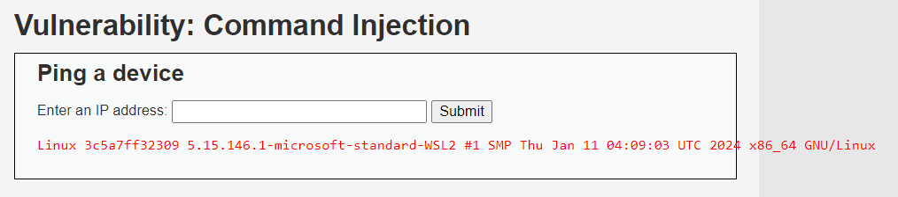

# Command Injection
## Definisi

Command Injection adalah jenis kerentanan di mana seorang penyerang dapat menjalankan perintah yang tidak sah pada sistem host yang menjadi target. Kerentanan ini biasanya terjadi pada aplikasi yang secara tidak aman memproses input pengguna dan kemudian menggunakan input tersebut sebagai bagian dari perintah sistem atau shell.


## Vulnerable Code

```php
<?php
if( isset( $_POST[ 'Submit' ]  ) ) {
    // Get input
    $target = $_REQUEST[ 'ip' ];

    // Determine OS and execute the ping command.
    if( stristr( php_uname( 's' ), 'Windows NT' ) ) {
        // Windows
        $cmd = shell_exec( 'ping  ' . $target );
    }
    else {
        // *nix
        $cmd = shell_exec( 'ping  -c 4 ' . $target );
    }

    // Feedback for the end user
    echo "<pre>{$cmd}</pre>";
}
?>
```

Dapat diketahui terdapat sebuah fitur untuk melakukan ping sebuah website, pada potongan kode tidak adanya sebuah filter dan sanitasi input.

Sehingga fitur dapat dieksploitasi dengan kerentanan Command Injection.



## Secure Code

```php
<?php
if( isset( $_POST[ 'Submit' ] ) ) {
    
    $target = filter_var($_REQUEST['ip'], FILTER_VALIDATE_IP);
    if ($target === false) {
        die('Alamat IP tidak valid.');
    }
    
    if (stristr(PHP_OS, 'WIN')) {
        // Windows
        $command = escapeshellcmd('ping ' . $target);
    } else {
        // *nix
        $command = escapeshellcmd('ping -c 4 ' . $target);
    }
    
    $output = shell_exec($command);

    // Feedback untuk pengguna akhir
    echo "<pre>" . $output . "</pre>";
}
?>
```

Penjelasan kode diatas sebagai berikut:
- `$target = filter_var($_REQUEST['ip'], FILTER_VALIDATE_IP);`: Filter dan validasi terhadap IP.
- `escapeshellcmd`: Mencegah karakter berbahaya.

## Referensi
1. https://portswigger.net/web-security/os-command-injection
2. https://owasp.org/www-community/attacks/Command_Injection